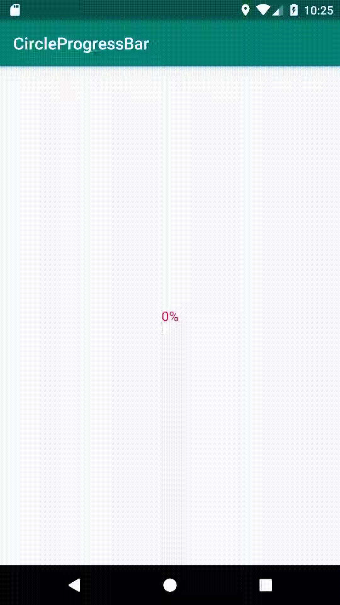

# CircleProgressBar

[](https://jitpack.io/#Paulimjr/CircleProgressBar)


Use the CircleProgressBar as a progress in your Android Application.



Usage
-----

### Step 1

Add it in your root build.gradle at the end of repositories

```groovy
    allprojects {
    	repositories {
    	    maven { url 'https://jitpack.io' }
    	}
    }

```

### Step 2

Add the dependency

```groovy
    dependencies {
        implementation 'com.github.Paulimjr:CircleProgressBar:1.0'
    }
```

### Adding in your layout XML

```xml

    <com.pcamilojr.circleprogressbar.CircleProgressBar
        android:id="@+id/progress_circular"
        app:layout_constraintTop_toTopOf="parent"
        app:layout_constraintBottom_toBottomOf="parent"
        app:layout_constraintStart_toStartOf="parent"
        app:layout_constraintEnd_toEndOf="parent"
        android:layout_width="150dp"
        android:layout_height="150dp"
        app:progress="0"
        app:strokeWidth="9"
        app:progressColor="@color/colorAccent"/>

```

* Use `setProgressAnimation (float, int) ` method to start the circle progress.
* Use `runProgress (interface) ` method to obtain the callback of the circle progress.

```kotlin
    override fun onResume() {
            super.onResume()
            progress_circular.setProgressAnimation(40f,2000)
            progress_circular.runProgress(progressListener)
        }
    
        private val progressListener = object : CircleProgressBar.CircleProgressBarCallback {
    
            override fun onProgressEnd() {
                //TODO do something...
            }
    
            override fun onProgressValue(progress: String, textColor: Int) {
                //TODO do something...
            }
        }
```

### Callback

Callback of the CircleProgressBar

```kotlin
    /**
     * Get the current value of the progress and color
     * 
     * @param progress the current value of the progress Ex: 30%
     * @param textColor the color of the progress
     */
    fun onProgressValue(progress: String, textColor: Int)
    
    /**
     * Callback when the progress is finished
     */
    fun onProgressEnd()
```

<h2>Customization in CircleProgressBar XML</h2>

| Attribute | Type | Description | Default |
|---|---|---|---|
| progress | int | The progress of circle | 0 |
| progressColor | int | The color of the circle | Color.GRAY |
| strokeWidth | int | The stroke width of the circle | 8 |

License 
--------

    Copyright 2015 UFreedom

    Licensed under the Apache License, Version 2.0 (the "License");
    you may not use this file except in compliance with the License.
    You may obtain a copy of the License at

       http://www.apache.org/licenses/LICENSE-2.0

    Unless required by applicable law or agreed to in writing, software
    distributed under the License is distributed on an "AS IS" BASIS,
    WITHOUT WARRANTIES OR CONDITIONS OF ANY KIND, either express or implied.
    See the License for the specific language governing permissions and
    limitations under the License.
